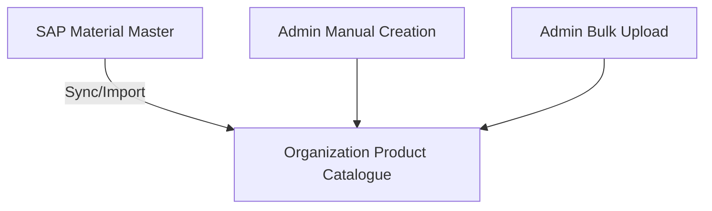

# Product Catalogue Module – Enhanced Design Specification

This document provides a detailed overview of the Enhanced Product Catalogue Module, including its multi-layer structure, menu systems, workflows, database schema, and SAP integration details.

---

## 1. Product Catalogue Structure

The Product Catalogue is designed as a three-layer system to segregate organizational masters, supplier offerings, and commercial conditions:

### Layer 1 – Organization Product Catalogue
- **Owner:** Procurement Team
- **Purpose:** Houses all approved materials and products available within the enterprise.
- **Data Sources:**
  - **SAP Material Master** (Sync/Import)
  - **Manual Admin Entry** (Single SKU Creation)
  - **Bulk Upload** (Admin CSV/Excel Upload)



---

## 2. Menu & Navigation Structures

### Admin Side (Procurement Portal)
The administration panel provides controls for organizational catalogue masters, relationship vetting, commercial approvals, and contracts:

```
Admin Side Panel
├── Product Master (SKU list, standard categories/UOMs, search & exports)
├── Supplier Product Approvals (Review supplier-material capabilities)
├── Price Approvals (Review pricing, MOQ, and lead time terms)
├── Contract Management (Create Quantity & Value contracts tied to SAP)
└── Product Reports (Exportable analysis of catalog distributions & mappings)
```

### Supplier Side (Supplier Portal)
The supplier interface is built to allow suppliers to view active enterprise needs, map their standard items to enterprise SKUs, and submit proposals:

```
Supplier Side Panel
└── Product Catalogue
    ├── Available Products (SAP Material/SKU Listing)
    ├── Register Existing Product (Map supplier SKU to organization SKU)
    ├── Product Upload (Bulk supplier mapping/spec upload)
    ├── Propose New Product (Propose new materials not in organization catalogue)
    ├── Price Approval (Track commercial approval status)
    └── Approval Status (View product eligibility status)
```

---

## 3. Operations & Workflows

### Supplier Product Mapping (Register Product)
Suppliers associate themselves with an existing Organization Product SKU and maintain their specific parameters:
- **Supplier Product Code** (Supplier's internal catalog SKU)
- **Supplier Price** (Ex-works price)
- **MOQ** (Minimum Order Quantity)
- **Delivery Lead Time** (in Days)
- **Packaging Details** (shipping boxes, crates, bundle packs)
- **Product Image** (image attachments)
- **Technical Datasheet** (spec sheet PDFs)
- **Product Shape / Geometry**

### Propose New Product Workflow
When a supplier wishes to provide a material that is not currently in the Organization Catalogue, they initiate a proposal:

```
[Supplier Proposal]
         │
         ▼
[Procurement Review]
         │
         ▼
[Technical Review]
         │
         ▼
    [Approved]
         │
         ▼
[New Product Created in Org Catalogue]
         │
         ▼
[Supplier-Product Mapping Established]
```

#### Proposal Input Parameters:
- Product Name & Category
- Product Description & Specifications
- Product Images & Datasheets
- Proposed Initial Unit Price

---

## 4. Approval Structure

To maintain compliance and competitive pricing, two separate approvals are executed:

### Approval 1 – Product Approval (Technical & Compliance)
- **Purpose:** Authorizes the supplier's technical capability to supply the specific material.
- **Checks:**
  - Supplier manufacturing capability
  - Product compliance with specifications
  - ISO/regulatory certifications
  - Technical suitability
- **Status Lifecycle:** `Draft` ➔ `Submitted` ➔ `Under Review` ➔ `Approved` ➔ `Rejected`

### Approval 2 – Price Approval (Commercial Terms)
- **Purpose:** Reviews and authorizes the commercial terms for procurement.
- **Checks:**
  - Price competitiveness
  - Commercial terms & currency
  - MOQ feasibility
  - Lead time compliance
- **Status Lifecycle:** `Pending Price Approval` ➔ `Price Approved` ➔ `Price Rejected`

---

## 5. End-to-End Procurement Lifecycle

```
[Supplier Selects SKU]
         │
         ▼
[Submits Mapping & Price]
         │
         ▼
[Product Technical Approval]
         │
         ▼
[Price Commercial Approval]
         │
         ▼
[Vendor Info Record (PIR) Creation]
         │
         ▼
[Source List Entry Created]
         │
         ▼
[Quantity/Value Contract Created]
         │
         ▼
[Supplier Activated for Procurement]
```

---

## 6. SAP S/4HANA Integration Design

### A. Product Import
Periodic sync from SAP Material Master into the Portal Product Catalogue database table.
- **Import Objects:**
  - `Material` (SKU Code)
  - `Material Description`
  - `Material Group` (Category)
  - `UOM` (Unit of Measure)

### B. Post-Product Approval (Mapping)
- **Action:** Generates a database binding between the Supplier and the Product Master ID to activate technical compliance flags.

### C. Post-Price Approval (Purchasing Info Record - PIR)
- **Action:** Triggers the creation of a **Purchasing Info Record** in SAP.
- **Transmitted Fields:**
  - `Vendor` (Supplier ID)
  - `Material` (SKU Code)
  - `Price` (Agreed Unit Price)
  - `Currency`
  - `MOQ` (Minimum Order Quantity)

### D. Source List Creation
- **Action:** Inserts an entry into the approved SAP **Source List**.
- **Purpose:** Automatically establishes the supplier as a preferred, valid source of supply for automated MRP runs.

### E. Contract Creation
- **Supported Types:**
  - **Quantity Contracts** (Target release quantity limit)
  - **Value Contracts** (Target monetary purchase limit)
- **Transmitted Fields:**
  - `Contract Number`
  - `Supplier`
  - `Product SKU`
  - `Validity Period` (Start / End dates)
  - `Agreed Price`
  - `Target Quantity` / `Target Value`

---

## 7. Database Model Design

The following tables are used to store the multi-layered product catalogue structures:

### A. `PRODUCT_MASTER`
Stores core catalog items available within the organization.

| Column | Type | Description |
| :--- | :--- | :--- |
| **Product_ID** (PK) | VARCHAR(40) | Unique SAP Material Code or SKU |
| **Product_Code** | VARCHAR(100) | Secondary reference code |
| **Product_Name** | VARCHAR(100) | Standard product title |
| **Category** | VARCHAR(100) | Material Group from SAP |
| **Product_Type** | VARCHAR(100) | SAP material type classification |
| **UOM** | VARCHAR(50) | Unit of Measure |
| **Status** | VARCHAR(20) | Active, Inactive, Archived |

### B. `SUPPLIER_MASTER`
Stores supplier profiles.

| Column | Type | Description |
| :--- | :--- | :--- |
| **Supplier_ID** (PK) | VARCHAR(40) | Unique Supplier Vendor Code (from SAP) |
| **Supplier_Name** | VARCHAR(255) | Corporate Legal Name |

### C. `SUPPLIER_PRODUCT`
Establishes the technical capability mapping between suppliers and materials.

| Column | Type | Description |
| :--- | :--- | :--- |
| **Mapping_ID** (PK) | INT (Auto) | Unique mapping reference |
| **Supplier_ID** (FK) | VARCHAR(40) | References `SUPPLIER_MASTER` |
| **Product_ID** (FK) | VARCHAR(40) | References `PRODUCT_MASTER` |
| **Product_Approval_Status** | VARCHAR(30) | `Draft`, `Submitted`, `Under Review`, `Approved`, `Rejected` |

### D. `SUPPLIER_PRICE`
Maintains pricing terms linked to approved mappings.

| Column | Type | Description |
| :--- | :--- | :--- |
| **Price_ID** (PK) | INT (Auto) | Unique price entry identifier |
| **Mapping_ID** (FK) | INT | References `SUPPLIER_PRODUCT` |
| **Unit_Price** | DECIMAL(15,2) | Proposed purchase price |
| **Currency** | VARCHAR(5) | e.g. INR, USD, EUR |
| **MOQ** | INT | Minimum order quantity |
| **Lead_Time** | INT | Lead time in days |
| **Price_Approval_Status** | VARCHAR(30) | `Pending Price Approval`, `Price Approved`, `Price Rejected` |

### E. `PRODUCT_PROPOSAL`
Tracks new material proposals from suppliers.

| Column | Type | Description |
| :--- | :--- | :--- |
| **Proposal_ID** (PK) | INT (Auto) | Unique proposal reference |
| **Supplier_ID** (FK) | VARCHAR(40) | References `SUPPLIER_MASTER` |
| **Product_Name** | VARCHAR(100) | Suggested product title |
| **Description** | TEXT | Explanation of the item |
| **Category** | VARCHAR(100) | Targeted category |
| **Specifications** | TEXT | Detailed properties / specs |
| **Image_URL** | VARCHAR(255) | Product photo location |
| **Status** | VARCHAR(30) | `Submitted`, `Under Review`, `Approved`, `Rejected` |

---

## 8. Development Roadmap

- **Phase 1: Catalogue Core (Active)**
  - Organization catalogue master listing & CRUD operations
  - Supplier material registration and parameter mapping
  - Dual approval workflows (Product Capability & Pricing)
- **Phase 2: RFQ Integration (Planned)**
  - RFQ matching based on supplier capability mapping
  - Supplier quotation submission tied to registered pricing
- **Phase 3: Purchase Orders (Planned)**
  - Automatic PIR lookup during PO generation
  - PO dispatch, confirmation, and ASN posting
- **Phase 4: Accounts settlement (Planned)**
  - Automated three-way matching (PO ➔ Delivery ➔ Invoice)
- **Phase 5: Analytical Reports & KPI Dashboards (Planned)**
  - Lead time compliance reports, pricing variance analysis
